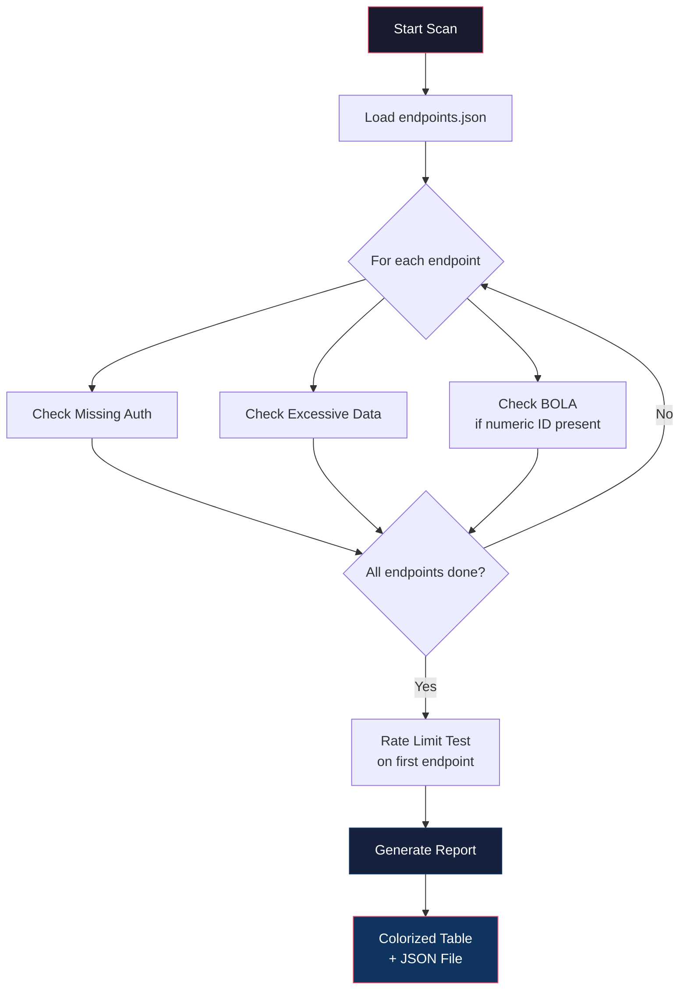
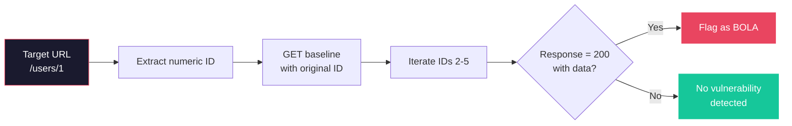
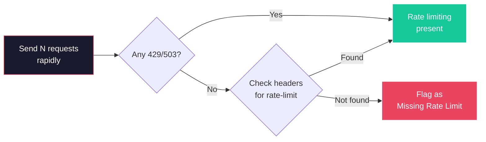

# 🔌 API-Jack — REST API Security Scanner

**API-Jack** is a CLI tool that systematically tests REST APIs for common vulnerabilities from the [OWASP API Security Top 10](https://owasp.org/www-project-api-security/). It helps security engineers and developers identify missing authentication, broken object level authorization (BOLA), excessive data exposure, missing rate limiting, and mass assignment vulnerabilities.

## Features

| Check | OWASP Mapping | Description |
|-------|--------------|-------------|
| **Missing Authentication** | API1 / API2 | Detects endpoints accessible without valid auth tokens |
| **BOLA** | API1 | Broken Object Level Authorization via ID enumeration |
| **Excessive Data Exposure** | API3 | Identifies sensitive fields leaked in API responses |
| **Rate Limiting** | API4 | Tests if endpoints can be flooded without throttling |
| **Mass Assignment** | API6 | Attempts to inject privileged fields into API requests |

## Installation

```bash
pip install -r requirements.txt
chmod +x apijack.py
```

## Usage

### Full Scan from Endpoint Definitions

```bash
python apijack.py scan \
  --url https://api.example.com \
  --endpoints endpoints.json \
  --json report.json
```

### Individual Checks

```bash
# Test for Broken Object Level Authorization
python apijack.py detect-bola --url https://api.example.com/users/1

# Test rate limiting
python apijack.py rate-limit --url https://api.example.com/login --requests 100

# Check for excessive data exposure
python apijack.py expose --url https://api.example.com/users/me

# Test mass assignment vulnerability
python apijack.py mass-assign \
  --url https://api.example.com/users \
  --fields is_admin,role
```

### Verbose Mode

Add `-v` to see detailed request/response information for debugging.

```bash
python apijack.py -v scan --url https://api.example.com --endpoints endpoints.json
```

## Endpoint Definition File

The `endpoints.json` file specifies the API surface to scan:

```json
[
  {
    "method": "GET",
    "path": "/users/{id}",
    "expected_status": 200,
    "auth_type": "required",
    "body_template": null,
    "description": "Get user by ID"
  }
]
```

| Field | Description |
|-------|-------------|
| `method` | HTTP method (GET, POST, PUT, DELETE, PATCH) |
| `path` | Endpoint path (use `{id}` for templated IDs) |
| `expected_status` | Expected HTTP status on success |
| `auth_type` | `"required"` or `"none"` — controls auth tests |
| `body_template` | Optional request body template (JSON) |

## Scanning Workflow



### BOLA Detection Flow



### Rate Limit Detection Flow



## Output

Results are displayed as a colorized severity table:

```text
  ╔══════════════════════════════════════════════════════════════════╗
  ║                       API-Jack Scan Results                     ║
  ╚══════════════════════════════════════════════════════════════════╝

  CRITICAL │ Broken Object Level Authorization (BOLA)
            ├─ Endpoint: GET https://api.example.com/users/1
            ├─ Detail:   4 alternate object ID(s) returned accessible data
            └─ Fix:      Implement server-side authorization checks...

  Summary: 1 CRITICAL, 2 HIGH
  Total:   3 finding(s)
```

### JSON Report

Use `--json report.json` to save findings in structured format for CI/CD integration:

```json
{
  "tool": "API-Jack v1.0.0",
  "scan_timestamp": "2026-07-19T12:00:00Z",
  "summary": { "CRITICAL": 1, "HIGH": 2 },
  "total_findings": 3,
  "findings": [
    {
      "id": "a1b2c3d4",
      "check": "bola",
      "severity": "CRITICAL",
      "title": "Broken Object Level Authorization (BOLA)",
      "endpoint": "https://api.example.com/users/1",
      "method": "GET",
      "evidence": { "accessible_ids": [2, 3, 4, 5] }
    }
  ]
}
```

## Project Structure

```
22-API-Jack/
├── apijack.py              # Main CLI tool
├── endpoints.json           # Sample endpoint definitions
├── requirements.txt         # Python dependencies
├── LICENSE                  # MIT License
├── .gitignore
├── README.md
├── docs/
│   └── engineering-report.md  # Methodology & OWASP coverage
├── examples/
│   ├── full_scan_example.py
│   └── individual_checks_example.py
└── tests/
    └── test_apijack.py      # 20+ mocked tests
```

## Running Tests

```bash
pip install requests
python -m pytest tests/ -v
```

All tests use mocked HTTP requests — no real API calls.

## License

MIT — see [LICENSE](LICENSE).
